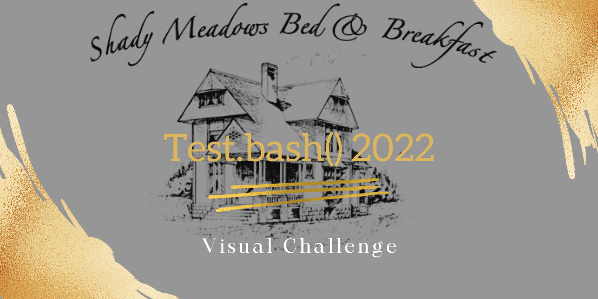
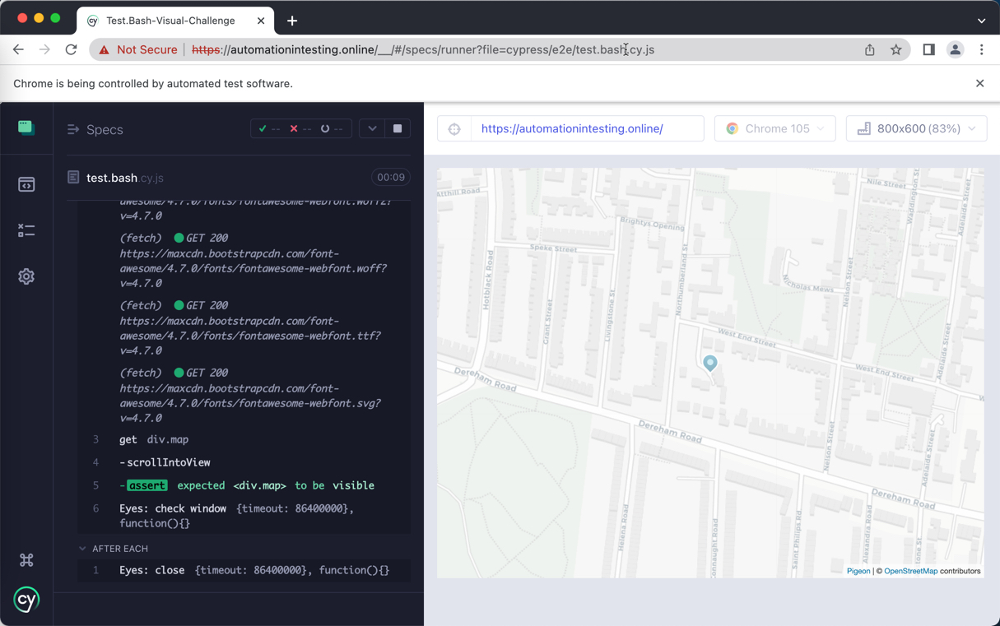

 

# Test.Bash() 2022 Visual Challenge

This repo is solving the Visual Challenges that is focused on UI visual automation from the Ministry of Testing. (https://club.ministryoftesting.com/t/take-the-test-bash-2022-visual-challenge-no-longer-accepting-submissions/61211)

# Restful Booker Platform

The sample website application for this challenge [Restful Brooker Platform](https://automationintesting.online/) is kindly provided by [Mark Winteringham](https://twitter.com/2bittester) / [Richard Bradshaw](https://twitter.com/FriendlyTester).

# The Challenge :

1. Open a browser and navigate to https://automationintesting.online/
2. Use Applitools to take a screenshot of the Map section of the homepage and create a test report
3. Confirm in the test report that the screenshot is correct
4. Rerun to the test to confirm it now passes

# How to start the test

1. Clone this repository
2. Execute 'npm install' in your local folder to install all dependencies (including cypress.io)
3. Fill in your API Key for Applitools in the applitools.config.js file
4. Execute 'npm test' to start the cypress test runner
5. Cypress is opening
6. Select E2ETesting
7. Choose Browser of choice e.g. Chrome and click on the green button
8. Browser with the test is opening
9. Select the tests and click on it
10. The test will automatically start and execute the defined assertions and steps
11. At the end you can see the results of the executed tests
    

# Contact

You can find me on [Twitter](https://twitter.com/_ChristinePinto).

# LICENSE

[MIT](LICENSE).
